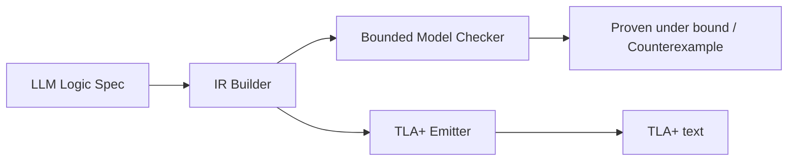

# llm-formal-verify

**Bounded formal checks for business logic that LLMs generate.**

LLM-generated logic often "works in tests" and still fails on edge cases you
never thought to write down. `llm-formal-verify` (CLI: `lfv`) lets you move
those rules into a machine-checkable specification:

1. Describe state variables with **finite domains**.
2. Describe **initial states**, **transitions**, and **invariants**.
3. Run a **bounded model checker** that exhaustively explores the state space
   and prints a concrete counterexample when a property breaks.
4. Optionally export a **TLA+-like module** for human review.

## Honest scope

| This project IS | This project is NOT |
| --- | --- |
| A small IR for predicates, transitions, invariants | A full proof assistant (Coq, Isabelle, …) |
| Exhaustive BMC over small finite domains | Unbounded verification |
| Bounded *reachability* checks (labeled "liveness") | Full temporal logic / LTL / CTL |
| A TLA+-like *text export* | A TLC / Apalache integration |

If a property passes `lfv check --bound N`, it has been verified for every
behavior reachable within `N` steps on the declared finite domains. That is
useful and honest — it is not a mathematical proof for all time.

## Architecture



## Install

```bash
pip install -e ".[dev]"
```

Requires Python 3.11+. Runtime dependencies: **none** (stdlib only). Tests
use `pytest`.

## Quick start

```bash
# Scaffold a new project (writes spec.json and .lfv.json)
lfv init my-specs && cd my-specs
lfv check spec.json

# Run the bundled safe example (should PASS)
lfv check examples/safe_transfer.json --bound 6

# Run the bundled buggy example (should FAIL with a counterexample)
lfv check examples/unsafe_transfer.json --bound 6

# Same failure, machine-readable (CI / dashboards)
lfv check examples/unsafe_transfer.json --bound 6 --json

# Batch: check several specs (or a directory) and print an aggregate table
lfv check examples/safe_transfer.json examples/unsafe_transfer.json --bound 6
lfv check my-specs/ --bound 6 --json

# Export TLA+-like text (optionally as JSON)
lfv tla examples/safe_transfer.json
lfv tla examples/safe_transfer.json --format json
```

Machine-readable payloads are pinned by published JSON Schemas — see
[docs/JSON_SCHEMA.md](docs/JSON_SCHEMA.md).

### Project config

Drop a `.lfv.json` (or `lfv.config.json`) next to your specs to set defaults
so CI and local runs agree without repeating flags:

```json
{
  "bound": 10,
  "search": "dfs"
}
```

Lookup order: explicit CLI flag > `.lfv.json` > `lfv.config.json` > built-in
defaults (`bound=8`, `search=bfs`). `search` is `bfs` (shortest
counterexample) or `dfs` (depth-first).

See [docs/COUNTEREXAMPLE.md](docs/COUNTEREXAMPLE.md) for a full walkthrough
of reading and fixing a counterexample, and [docs/PUBLIC_API.md](docs/PUBLIC_API.md)
for the 0.x compatibility promise and typed exceptions.

### Python-embedded builder

```python
from llm_formal_verify import (
    SpecBuilder, bounded_model_check, eq, lit, var, add, sub, and_, gt, lt, not_,
)

b = SpecBuilder("SafeTransfer", description="two-account transfer")
b.int_var("balance_a", 0, 4)
b.int_var("balance_b", 0, 4)
b.bool_var("locked")

b.init(
    eq(var("balance_a"), lit(2)),
    eq(var("balance_b"), lit(2)),
    eq(var("locked"), lit(False)),
)
b.action(
    "TransferAtoB",
    guard=and_(gt(var("balance_a"), lit(0)), lt(var("balance_b"), lit(4)), not_(var("locked"))),
    assign={
        "balance_a": sub(var("balance_a"), lit(1)),
        "balance_b": add(var("balance_b"), lit(1)),
    },
)
b.safety("total_conserved", eq(add(var("balance_a"), var("balance_b")), lit(4)))

result = bounded_model_check(b.build(), bound=6)
print(result.format())
assert result.ok
```

### JSON spec format

Specs serialize to JSON with a tiny expression tree:

```json
{
  "name": "Counter",
  "variables": [{"name": "n", "domain": [0, 1, 2, 3]}],
  "init": {"kind": "binop", "op": "eq",
           "left": {"kind": "var", "name": "n"},
           "right": {"kind": "lit", "value": 0}},
  "actions": [{
    "name": "Inc",
    "guard": {"kind": "binop", "op": "lt",
              "left": {"kind": "var", "name": "n"},
              "right": {"kind": "lit", "value": 3}},
    "assignments": [{
      "target": "n",
      "expr": {"kind": "binop", "op": "add",
               "left": {"kind": "var", "name": "n"},
               "right": {"kind": "lit", "value": 1}}
    }]
  }],
  "invariants": [],
  "checks": []
}
```

Regenerate the bundled examples with:

```bash
python examples/generate_specs.py
```

## CLI

```
lfv init [DIR] [--force]                          # scaffold spec.json + .lfv.json
lfv check SPEC.json [SPEC.json ...] [--bound N] [--search bfs|dfs] [--json|--format json]
                                                  # bounded model check; exit 0 pass, 1 fail, 2 error
                                                  # multiple paths / directories print a pass/fail table
lfv tla SPEC.json                                 # print TLA+-like module
```

## How the checker works

1. Enumerate the Cartesian product of all variable domains.
2. Keep states satisfying `Init`.
3. Explore outward up to the bound, applying every enabled action.
   `search=bfs` (default) finds the shortest counterexample;
   `search=dfs` can reach deep states faster on some models.
4. Evaluate every invariant and safety check on every visited state.
5. Evaluate each bounded-liveness check for *reachability* within the bound.
6. On the first safety violation, reconstruct a parent-pointer trace and
   print it as a counterexample.

State space size is `prod(len(domain))`. Keep domains small (that is the
point of *bounded* checking).

## Development

```bash
pip install -e ".[dev]"
pytest -v
```

## License

MIT — see [LICENSE](LICENSE).
